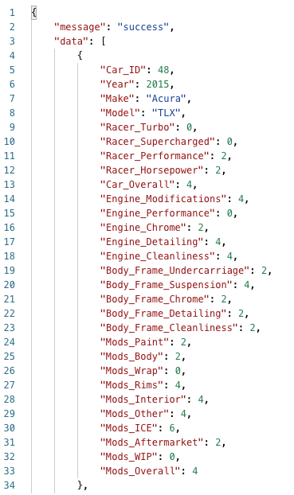
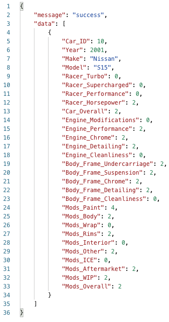
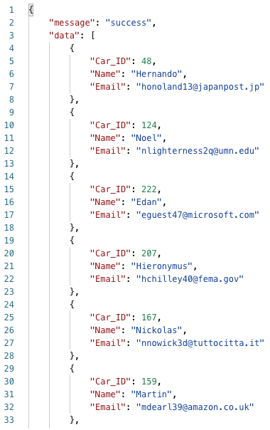
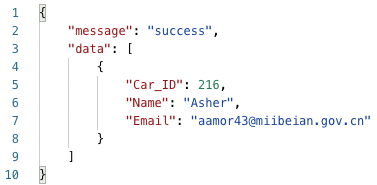

## API Documentation

### Resource Description

This API enables the user to view data on cars in a database, add to the data in the database, and update the data in the database.

### Endpoints and Methods

`GET /api/cars`

Endpoint to get a list of the cars in the database along with information about each car. The query string parameters listed below allow for the filtering of the data and the return of records that meet certain specifications. 

| Query string parameter | Required/optional | Description | Type |
| ---------------------- | ----------------- | ----------- | ---- |
| carid | Optional | Unique ID number identifying each car | INT |
| year | Optional | The car's year | INT |
| make | Optional | The car's make | TEXT |
| model | Optional | The car's model | TEXT |
| racerturbo | Optional | Score for the car's racer turbo | INT |
| racersupercharged | Optional | Score for the car's racer supercharged | INT |
| racerperformance | Optional | Score for the car's racer performance | INT |
| racerhorsepower | Optional | Score for the car's racer horsepower | INT |
| caroverall | Optional | Score for the car overall | INT |
| enginemodifications | Optional | Score for the car's engine modifications | INT |
| engineperformance | Optional | Score for the car's engine performance | INT |
| enginechrome | Optional | Score for the car's engine chrome | INT |
| enginedetailing | Optional | Score for the car's engine detailing | INT |
| enginecleanliness | Optional | Score for the car's engine cleanliness | INT |
| bfundercarriage | Optional | Score for the car's body frame undercarriage | INT |
| bfsuspension | Optional | Score for the car's body frame suspension | INT |
| bfchrome | Optional | Score for the car's body frame chrome | INT |
| bfdetailing | Optional | Score for the car's body frame detailing | INT |
| bfcleanliness | Optional | Score for the car's body frame cleanliness | INT |
| modspaint | Optional | Score for the car's paint mods | INT |
| modsbody | Optional | Score for the car's body mods | INT |
| modswrap | Optional | Score for the car's wrap mods | INT |
| modsrims | Optional | Score for the car's rims mods | INT |
| modsinterior | Optional | Score for the car's interior mods | INT |
| modsother | Optional | Score for the car's other mods | INT |
| modsice | Optional | Score for the car's ICE mods | INT |
| modsaftermarket | Optional | Score for the car's aftermarket mods | INT |
| modswip | Optional | Score for the car's WIP mods | INT |
| modsoverall | Optional | Score for the car's overall mods | INT | 

### Sample request to get all cars in the database

### Partial sample response of all cars in the database

### Sample request to get cars in the the databse with year = 2001 and make = Nissan

### Sample response of cars in the database with year = 2001 and make = Nissan

`GET /api/owners`

Endpoint to get a list of the owners in the database along with the car ID of the owner's car, the owner's name, and the owner's email address. The query string parameters listed below allow for the filtering of the data and the return of records that meet certain specifications. 

| Query string parameter | Required/optional | Description | Type |
| ---------------------- | ----------------- | ----------- | ---- |
| carid | Optional | Unique ID number identifying each car | INT |
| name | Optional | Name of car's owner | TEXT |
| email | Optional | Email address of car's owner | TEXT |

### Sample request to get all owners in the database

### Partial sample response of all owners in the database

### Sample request to get owners in the the databse with name = Asher

### Sample response of cars in the database with name = Asher

`GET /api/cars/{carid}`

`GET /api/owners/{name}`

`POST /api/cars/`

`POST /api/owners/`

`PATCH /api/cars/`

`PATCH /api/cars/{carid}`

`PATCH /api/owners/`

`PATCH /api/owners/{carid}`

