## API Documentation

### Resource Description

This API enables the user to view data on cars in a database, add to the data in the database, and update the data in the database.

### Endpoints and Methods

`GET /api/cars`
--------------------------------------------------------------

Endpoint to get a list of the cars in the database along with information about each car. The query string parameters listed below allow for the filtering of the data and the return of records that meet certain specifications. 

| Query string parameter | Required/optional | Description | Type |
| ---------------------- | ----------------- | ----------- | ---- |
| carid | Optional | Unique ID number identifying each car | INT |
| year | Optional | The car's year | INT |
| make | Optional | The car's make | TEXT |
| model | Optional | The car's model | TEXT |
| racerturbo | Optional | Score for the car's racer turbo | INT |
| racersupercharged | Optional | Score for the car's racer supercharged | INT |
| racerperformance | Optional | Score for the car's racer performance | INT |
| racerhorsepower | Optional | Score for the car's racer horsepower | INT |
| caroverall | Optional | Score for the car overall | INT |
| enginemodifications | Optional | Score for the car's engine modifications | INT |
| engineperformance | Optional | Score for the car's engine performance | INT |
| enginechrome | Optional | Score for the car's engine chrome | INT |
| enginedetailing | Optional | Score for the car's engine detailing | INT |
| enginecleanliness | Optional | Score for the car's engine cleanliness | INT |
| bfundercarriage | Optional | Score for the car's body frame undercarriage | INT |
| bfsuspension | Optional | Score for the car's body frame suspension | INT |
| bfchrome | Optional | Score for the car's body frame chrome | INT |
| bfdetailing | Optional | Score for the car's body frame detailing | INT |
| bfcleanliness | Optional | Score for the car's body frame cleanliness | INT |
| modspaint | Optional | Score for the car's paint mods | INT |
| modsbody | Optional | Score for the car's body mods | INT |
| modswrap | Optional | Score for the car's wrap mods | INT |
| modsrims | Optional | Score for the car's rims mods | INT |
| modsinterior | Optional | Score for the car's interior mods | INT |
| modsother | Optional | Score for the car's other mods | INT |
| modsice | Optional | Score for the car's ICE mods | INT |
| modsaftermarket | Optional | Score for the car's aftermarket mods | INT |
| modswip | Optional | Score for the car's WIP mods | INT |
| modsoverall | Optional | Score for the car's overall mods | INT | 

### Sample request to get all cars in the database

### Partial sample response of all cars in the database

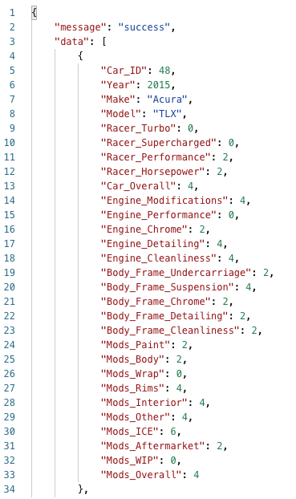

### Sample request to get some cars in the database with certain specifications

Get cars with year = 2001 and make = Nissan

### Sample response of cars in the database with certain specifications

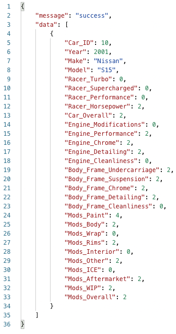

`GET /api/owners`
--------------------------------------------------------------

Endpoint to get a list of the owners in the database along with the car ID of the owner's car, the owner's name, and the owner's email address. The query string parameters listed below allow for the filtering of the data and the return of records that meet certain specifications. 

| Query string parameter | Required/optional | Description | Type |
| ---------------------- | ----------------- | ----------- | ---- |
| carid | Optional | Unique ID number identifying each car | INT |
| name | Optional | Name of car's owner | TEXT |
| email | Optional | Email address of car's owner | TEXT |

### Sample request to get all owners in the database

### Partial sample response of all owners in the database

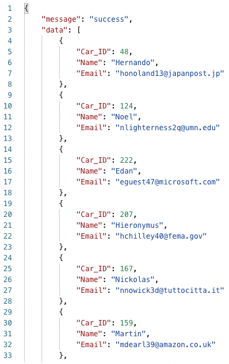

### Sample request to get owners in the the databse with certain specifications

Get owners in the database with name = Asher.

### Sample response of cars in the database with certain specifications

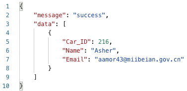

`GET /api/cars/{carid}`
--------------------------------------------------------------

Endpoint to get a sinlge car in the database along with information about that car.

| Path parameter | Description |
| -------------- | ----------- |
| {carid} | Unique ID of the car being looked up |

### Sample request to get a single car in the database by ID

Get car with ID 218. 

### Sample response of a single car in the database by ID

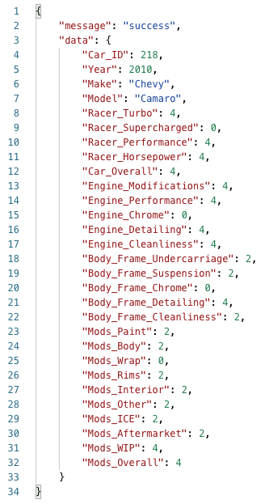

`GET /api/owners/{name}`
--------------------------------------------------------------

Endpoint to get a sinlge owner in the database along with the owner's name, email address, and the ID of their car.

| Path parameter | Description |
| -------------- | ----------- |
| {name} | Name of car's owner |

### Sample request to get a single owner in the database by name

Get owner with name Ted. 

### Sample response of a single owner in the database by name

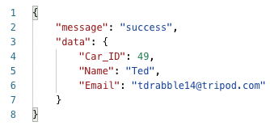

`POST /api/cars/`
--------------------------------------------------------------

Endpoint to add a new car/new cars to the database.

| Body parameter | Description |
| -------------- | ----------- |
| bulk | Object containing car objects to be added to the database. The bulk object contains a car or a list of cars to be added to the database. Each car object has the parameters listed below |

| Car object parameter | Required/optional | Description | Type |
| -------------------- | ----------------- | ----------- | ---- |
| carid | Optional | Unique ID number identifying each car | INT |
| year | Optional | The car's year | INT |
| make | Optional | The car's make | TEXT |
| model | Optional | The car's model | TEXT |
| racerturbo | Optional | Score for the car's racer turbo | INT |
| racersupercharged | Optional | Score for the car's racer supercharged | INT |
| racerperformance | Optional | Score for the car's racer performance | INT |
| racerhorsepower | Optional | Score for the car's racer horsepower | INT |
| caroverall | Optional | Score for the car overall | INT |
| enginemodifications | Optional | Score for the car's engine modifications | INT |
| engineperformance | Optional | Score for the car's engine performance | INT |
| enginechrome | Optional | Score for the car's engine chrome | INT |
| enginedetailing | Optional | Score for the car's engine detailing | INT |
| enginecleanliness | Optional | Score for the car's engine cleanliness | INT |
| bfundercarriage | Optional | Score for the car's body frame undercarriage | INT |
| bfsuspension | Optional | Score for the car's body frame suspension | INT |
| bfchrome | Optional | Score for the car's body frame chrome | INT |
| bfdetailing | Optional | Score for the car's body frame detailing | INT |
| bfcleanliness | Optional | Score for the car's body frame cleanliness | INT |
| modspaint | Optional | Score for the car's paint mods | INT |
| modsbody | Optional | Score for the car's body mods | INT |
| modswrap | Optional | Score for the car's wrap mods | INT |
| modsrims | Optional | Score for the car's rims mods | INT |
| modsinterior | Optional | Score for the car's interior mods | INT |
| modsother | Optional | Score for the car's other mods | INT |
| modsice | Optional | Score for the car's ICE mods | INT |
| modsaftermarket | Optional | Score for the car's aftermarket mods | INT |
| modswip | Optional | Score for the car's WIP mods | INT |
| modsoverall | Optional | Score for the car's overall mods | INT | 

### Sample request to post a single car to the database

// Up to here

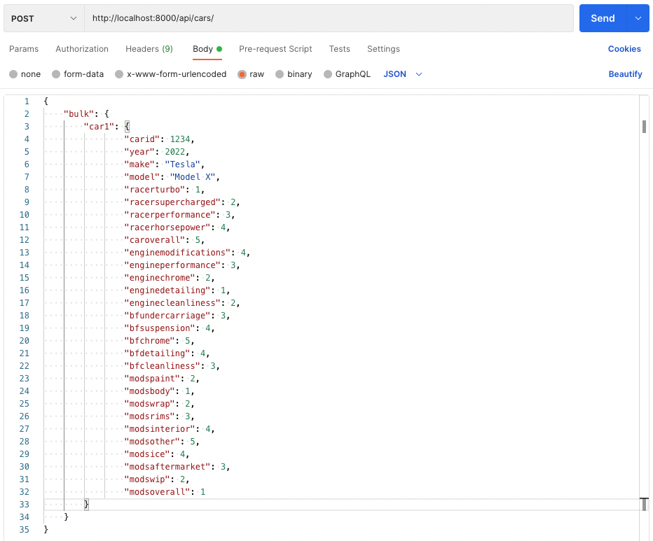

### Sample response from posting a single car to the database

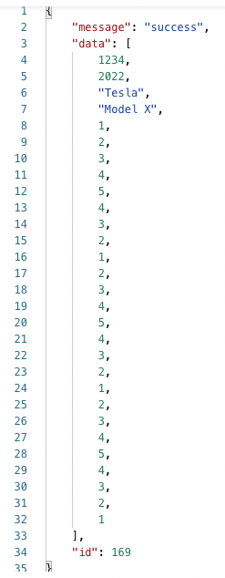

### Partial sample request to post multiple cars to the database

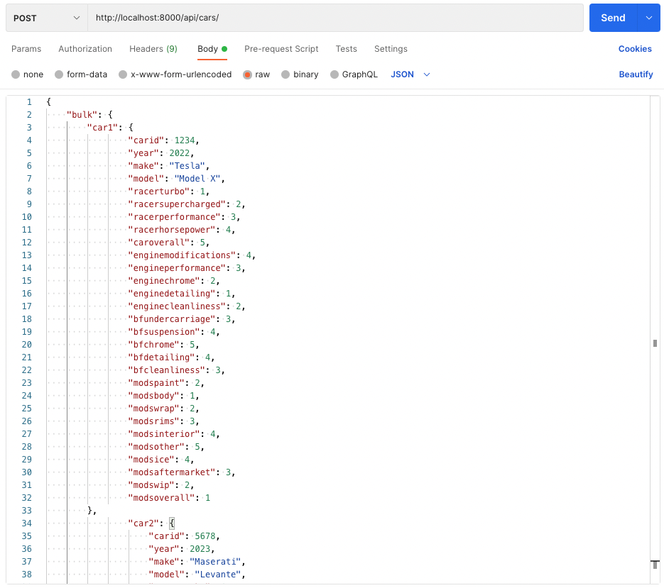

### Partial sample response from posting multiple cars to the database

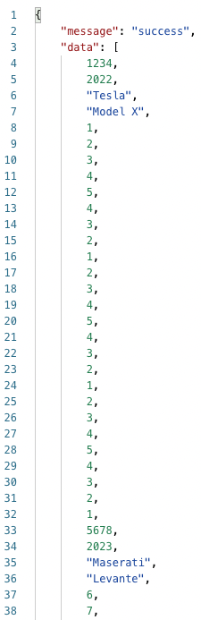

`POST /api/owners/`
--------------------------------------------------------------

Endpoint to add a new owner/new owners to the database.

| Body parameter | Description |
| -------------- | ----------- |
| bulk | Object containing owner objects to be added to the database. The bulk object contains an owner or a list of owners to be added to the database. Each owner object has the parameters listed below |

| Owner object parameter | Required/optional | Description | Type |
| ---------------------- | ----------------- | ----------- | ---- |
| carid | Optional | Unique ID number identifying each car | INT |
| name | Optional | Name of car's owner | TEXT |
| email | Optional | Email address of car's owner | TEXT |

### Sample request to post a single owner to the database

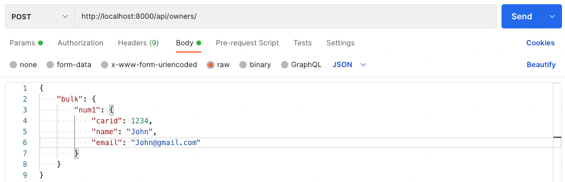

### Partial sample response from posting a single owner to the database

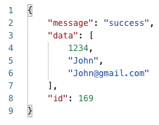

### Sample request to post multiple owners to the database

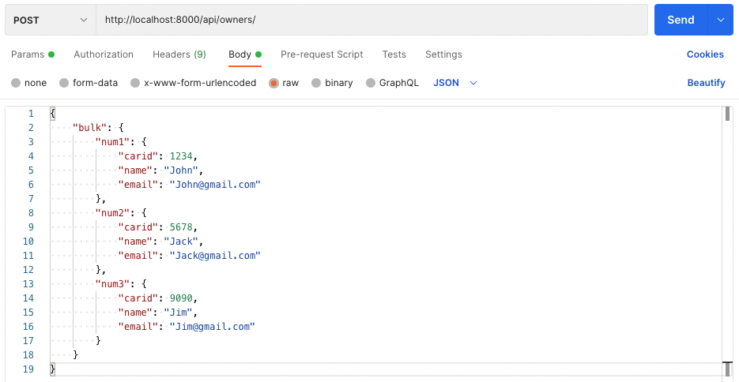

### Partial sample response from posting multiple owners to the database

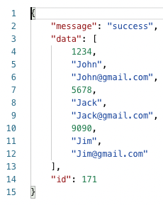

`PATCH /api/cars/`
--------------------------------------------------------------

Endpoint to update a single car or multiple cars already in the database. The body parameter(s) are the one(s) being updated, and the query string parameters enable the filtering of the data in the database to allow for only updating of records that meet certain specifications. 

| Body parameter | Required/optional | Description | Type |
| -------------- | ----------------- | ----------- | ---- |
| carid1 | Optional | Unique ID number identifying each car | INT |
| year1 | Optional | The car's year | INT |
| make1 | Optional | The car's make | TEXT |
| model1 | Optional | The car's model | TEXT |
| racerturbo1 | Optional | Score for the car's racer turbo | INT |
| racersupercharged1 | Optional | Score for the car's racer supercharged | INT |
| racerperformance1 | Optional | Score for the car's racer performance | INT |
| racerhorsepower1 | Optional | Score for the car's racer horsepower | INT |
| caroverall1 | Optional | Score for the car overall | INT |
| enginemodifications1 | Optional | Score for the car's engine modifications | INT |
| engineperformance1 | Optional | Score for the car's engine performance | INT |
| enginechrome1 | Optional | Score for the car's engine chrome | INT |
| enginedetailing1 | Optional | Score for the car's engine detailing | INT |
| enginecleanliness1 | Optional | Score for the car's engine cleanliness | INT |
| bfundercarriage1 | Optional | Score for the car's body frame undercarriage | INT |
| bfsuspension1 | Optional | Score for the car's body frame suspension | INT |
| bfchrome1 | Optional | Score for the car's body frame chrome | INT |
| bfdetailing1 | Optional | Score for the car's body frame detailing | INT |
| bfcleanliness1 | Optional | Score for the car's body frame cleanliness | INT |
| modspaint1 | Optional | Score for the car's paint mods | INT |
| modsbody1 | Optional | Score for the car's body mods | INT |
| modswrap1 | Optional | Score for the car's wrap mods | INT |
| modsrims1 | Optional | Score for the car's rims mods | INT |
| modsinterior1 | Optional | Score for the car's interior mods | INT |
| modsother1 | Optional | Score for the car's other mods | INT |
| modsice1 | Optional | Score for the car's ICE mods | INT |
| modsaftermarket1 | Optional | Score for the car's aftermarket mods | INT |
| modswip1 | Optional | Score for the car's WIP mods | INT |
| modsoverall1 | Optional | Score for the car's overall mods | INT |

| Query string parameter | Required/optional | Description | Type |
| ---------------------- | ----------------- | ----------- | ---- |
| carid2 | Optional | Unique ID number identifying each car | INT |
| year2 | Optional | The car's year | INT |
| make2 | Optional | The car's make | TEXT |
| model2 | Optional | The car's model | TEXT |
| racerturbo2 | Optional | Score for the car's racer turbo | INT |
| racersupercharged2 | Optional | Score for the car's racer supercharged | INT |
| racerperformance2 | Optional | Score for the car's racer performance | INT |
| racerhorsepower2 | Optional | Score for the car's racer horsepower | INT |
| caroverall2 | Optional | Score for the car overall | INT |
| enginemodifications2 | Optional | Score for the car's engine modifications | INT |
| engineperformance2 | Optional | Score for the car's engine performance | INT |
| enginechrome2 | Optional | Score for the car's engine chrome | INT |
| enginedetailing2 | Optional | Score for the car's engine detailing | INT |
| enginecleanliness2 | Optional | Score for the car's engine cleanliness | INT |
| bfundercarriage2 | Optional | Score for the car's body frame undercarriage | INT |
| bfsuspension2 | Optional | Score for the car's body frame suspension | INT |
| bfchrome2 | Optional | Score for the car's body frame chrome | INT |
| bfdetailing2 | Optional | Score for the car's body frame detailing | INT |
| bfcleanliness2 | Optional | Score for the car's body frame cleanliness | INT |
| modspaint2 | Optional | Score for the car's paint mods | INT |
| modsbody2 | Optional | Score for the car's body mods | INT |
| modswrap2 | Optional | Score for the car's wrap mods | INT |
| modsrims2 | Optional | Score for the car's rims mods | INT |
| modsinterior2 | Optional | Score for the car's interior mods | INT |
| modsother2 | Optional | Score for the car's other mods | INT |
| modsice2 | Optional | Score for the car's ICE mods | INT |
| modsaftermarket2 | Optional | Score for the car's aftermarket mods | INT |
| modswip2 | Optional | Score for the car's WIP mods | INT |
| modsoverall2 | Optional | Score for the car's overall mods | INT |

### Sample request to update multiple cars in the database

Updates all Acuras to Tesla Model X

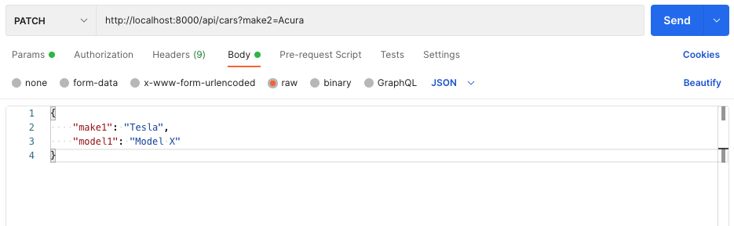

### Sample response from updating multiple cars in the database

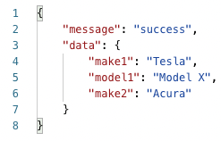

`PATCH /api/cars/{carid}`
--------------------------------------------------------------

Endpoint to update a single car in the database by carid. 

| Body parameter | Required/optional | Description | Type |
| -------------- | ----------------- | ----------- | ---- |
| carid1 | Optional | Unique ID number identifying each car | INT |
| year1 | Optional | The car's year | INT |
| make1 | Optional | The car's make | TEXT |
| model1 | Optional | The car's model | TEXT |
| racerturbo1 | Optional | Score for the car's racer turbo | INT |
| racersupercharged1 | Optional | Score for the car's racer supercharged | INT |
| racerperformance1 | Optional | Score for the car's racer performance | INT |
| racerhorsepower1 | Optional | Score for the car's racer horsepower | INT |
| caroverall1 | Optional | Score for the car overall | INT |
| enginemodifications1 | Optional | Score for the car's engine modifications | INT |
| engineperformance1 | Optional | Score for the car's engine performance | INT |
| enginechrome1 | Optional | Score for the car's engine chrome | INT |
| enginedetailing1 | Optional | Score for the car's engine detailing | INT |
| enginecleanliness1 | Optional | Score for the car's engine cleanliness | INT |
| bfundercarriage1 | Optional | Score for the car's body frame undercarriage | INT |
| bfsuspension1 | Optional | Score for the car's body frame suspension | INT |
| bfchrome1 | Optional | Score for the car's body frame chrome | INT |
| bfdetailing1 | Optional | Score for the car's body frame detailing | INT |
| bfcleanliness1 | Optional | Score for the car's body frame cleanliness | INT |
| modspaint1 | Optional | Score for the car's paint mods | INT |
| modsbody1 | Optional | Score for the car's body mods | INT |
| modswrap1 | Optional | Score for the car's wrap mods | INT |
| modsrims1 | Optional | Score for the car's rims mods | INT |
| modsinterior1 | Optional | Score for the car's interior mods | INT |
| modsother1 | Optional | Score for the car's other mods | INT |
| modsice1 | Optional | Score for the car's ICE mods | INT |
| modsaftermarket1 | Optional | Score for the car's aftermarket mods | INT |
| modswip1 | Optional | Score for the car's WIP mods | INT |
| modsoverall1 | Optional | Score for the car's overall mods | INT |

### Sample request to update a single car in the database by car ID

Update the racer turbo score, the racer supercharged score, the racer performance score, and the racer horsepower score for the car with ID 167 each to 100.

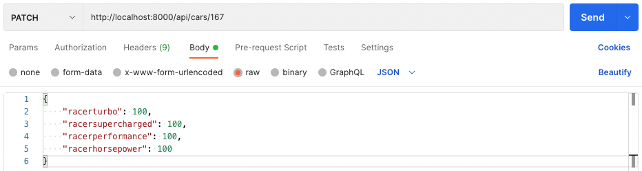

### Sample response from updating a single car in the database by car ID 

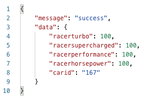

`PATCH /api/owners/`
--------------------------------------------------------------

Endpoint to update a single owner or multiple owners already in the database. The body parameter(s) are the one(s) being updated, and the query string parameters enable the filtering of the data in the database to allow for only updating of records that meet certain specifications. 

| Body parameter | Required/optional | Description | Type |
| ---------------------- | ----------------- | ----------- | ---- |
| carid1 | Optional | Unique ID number identifying each car | INT |
| name1 | Optional | Name of car's owner | TEXT |
| email1 | Optional | Email address of car's owner | TEXT |

| Query string parameter | Required/optional | Description | Type |
| ---------------------- | ----------------- | ----------- | ---- |
| carid2 | Optional | Unique ID number identifying each car | INT |
| name2 | Optional | Name of car's owner | TEXT |
| email2 | Optional | Email address of car's owner | TEXT |

### Sample request to update multiple owners in the database

Update the names of all owners named John to Johnny. 

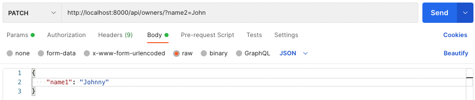

### Partial sample response from updating multiple owners in the database

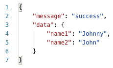

`PATCH /api/owners/{carid}`
--------------------------------------------------------------

Endpoint to update a single car in the database by carid. 

| Body parameter | Required/optional | Description | Type |
| ---------------------- | ----------------- | ----------- | ---- |
| carid1 | Optional | Unique ID number identifying each car | INT |
| name1 | Optional | Name of car's owner | TEXT |
| email1 | Optional | Email address of car's owner | TEXT |

### Sample request to update a single owner in the database

Update the email address of the owner of the car with ID 68 to Scot123@gmail.com.

### Partial sample response from updating a single owner in the database

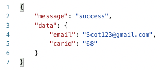

