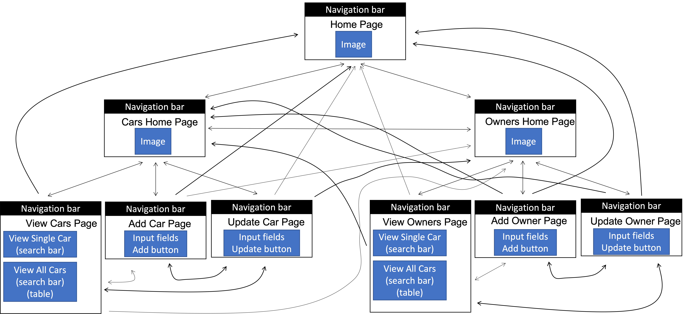

# Lab 5

Frontend interface for car data.

## Description

This project is a frontend interface built using a combination of HTML, CSS, JavaScript, and React. This interface complements the backend created as part of Lab 4 and allows users to view, add to, and update data that is stored in the database

## Dependencies

* react
* react-dom
* react-router-dom
* http-proxy-middleware

## Report Contents

The [client](./client/) folder contains all the source code for the project. Within the [client](./client/) folder, the [src](./client/src/) folder contains the actual code files. The [src](./client/src/) folder contains a [components](./client/src/components/) folder, a [routes](./client/src/routes/) folder, and a [stylesheets](./client/src/stylesheets/) folder, and an [images](./client/src/images/) folder.

* The [components](./client/src/components/) folder contains a [navigation](./client/src/components/navigation/) folder with components for navigation, a [cars](./client/src/components/cars/) folder with components for  the pages about the cars, and an [owners](./client/src/components/owners/) folder with components for the pages about the owners. 

* The [routes](./client/src/routes/) folder contains a [cars](./client/src/routes/cars/) folder with routes for the cars components and an [owners](./client/src/routes/owners/) with routes for the owners components. 

* The [stylesheets](./client/src/stylesheets/) folder contains a [navigation](./client/src/stylesheets/navigation/) folder with stylesheets for the navigation components, a [cars](./client/src/stylesheets/cars/) folder with stylesheets for the cars componenets, and an [owners](./client/src/stylesheets/owners/) folder with stylesheets for the owners components. 

* The [images](./client/src/images/) folder contains the images used on various pages of the application

* [App.js](./client/src/App.js) is the homepage of the application and [App.css](./client/src/App.css) is the stylesheet for [App.js](./client/src/App.js).

* [index.js](./client/src/index.js) provides the routing for the application. 

* [setupProxy](./client/src/setupProxy.js) uses http-proxy-middleware as a workaround for an error resulting from adding the proxy directly to the [package.json](./client/package.json).

## Getting Started

After cloning the project repository, you must connect to both the backend server and the frontend application. 

To connect to the backend server, please use the instructions provided in the [Getting Started](https://github.com/AdinaScheinfeld/CISC3140/tree/main/lab4_files#getting-started) section of the [README.md](../lab4_files/README.md) file in the [lab4_files](../lab4_files/) folder.

To connect to the frontend application, cd into the [client folder](./client/) and run the following line of code.

```
npm start
```

## Storyoard



